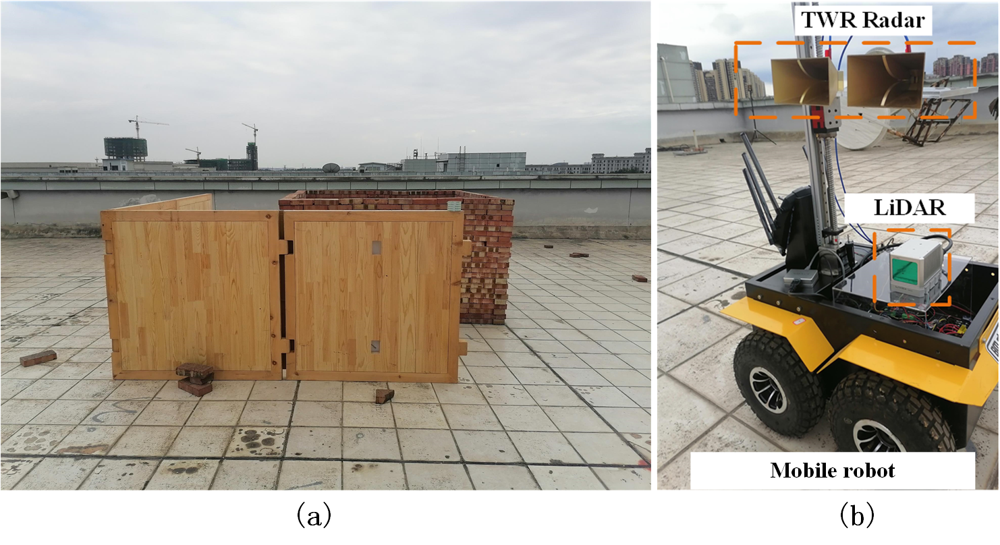
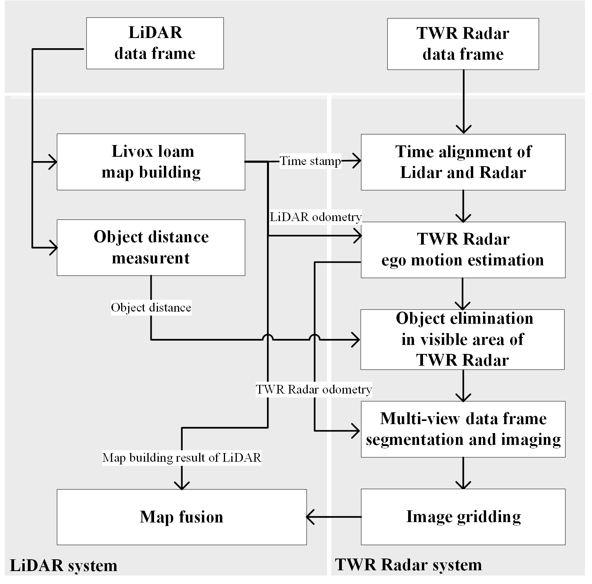
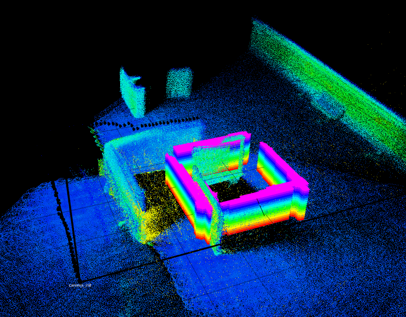

# CSMB-Lidar-Radar
Cooperative Sensing and Map Building Algorithm Using Lidar and Through-the-Wall Radar

# Abstract：
High-precision map building is a base function of autonomous driving and robot navigation. The existing map building system generally uses the combination of camera, Lidar, and millimeter-wave radar, which only mapping the area that can be sensed directly. However, the see-through and reconstruction capabilities of sensors for occluded area are also urgently needed. In this paper, a cooperative sensing and map building algorithm using Lidar and Through-the-wall Radar (TWR) is proposed to build a map of unknown scenario, including the objects in the occluded area. Specifically, first, the Livox loam algorithm is used for simultaneous location and mapping. Based on the self-location results, the TWR can be employed to reconstruct the occluded obstacles by using multi-view back projection imaging algorithm. Moreover, a data fusion algorithm is proposed to fuse map building results of Lidar and TWR. Finally, we confirm the proposed algorithm is effective in reconstructing the map in line-of-sight and occluded area.

# 1. Experiment
---
## 1.1 Experiment environment and Lidar-Radar system

## 1.2 Fusion algorithm pipline

## 1.3 Experimental results

# 2. Related paper
---
Cooperative Sensing and Map Building Algorithm Using Lidar and Through-the-Wall Radar
[CSMB-Lidar-Radar](https://link.springer.com/chapter/10.1007/978-981-16-9492-9_296#citeas)

# 3. Acknowledgments
Thanks for Livox loam(Lin, J., Zhang, F.: Loam livox: a fast, robust, high-precision Lidar odometry and mapping package for Lidars of small FoV. In: 2020 IEEE International Conference on Robotics and Automation (ICRA), pp. 3126–3131 (2020)). 
[Livox loam](https://github.com/hku-mars/loam_livox) and 
[Livox mapping](https://github.com/Livox-SDK/livox_mapping).
